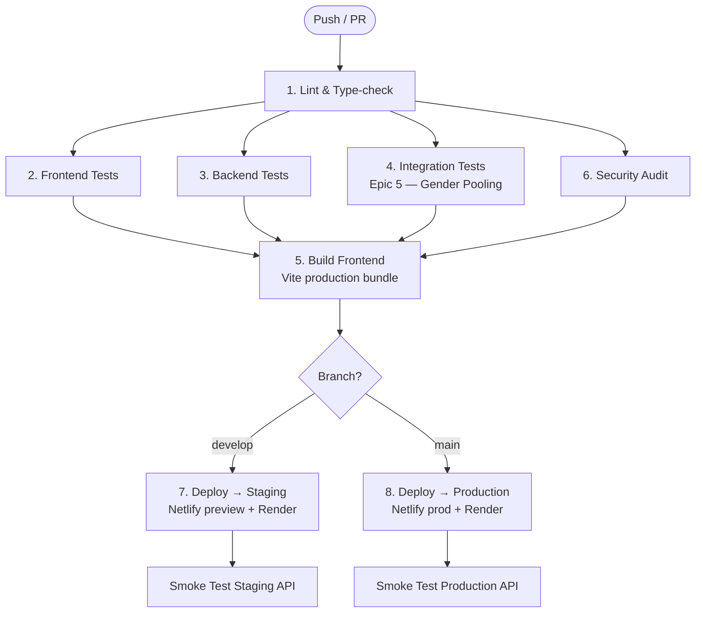

# LeafLift — CI/CD Pipeline

> **Tool:** GitHub Actions  
> **File:** [.github/workflows/ci-cd.yml](file:///d:/Amrita/SEM_6/Software_Engineering/Final_LeafLift/LeafLift/ridego---your-modern-ride-share/.github/workflows/ci-cd.yml)

---

## Pipeline Overview



---

## Jobs Breakdown

| # | Job | Trigger | Key Steps |
|---|---|---|---|
| 1 | **Lint & Type-check** | All pushes/PRs | `tsc --noEmit` on frontend + `npm ci` backend |
| 2 | **Frontend Tests** | After Job 1 | `npx vitest run` on root |
| 3 | **Backend Tests** | After Job 1 | `vitest run` in `server/` |
| 4 | **Integration Tests** | After Job 1 | Us. Story 5.5 gender pooling (29 tests) |
| 5 | **Build Frontend** | After Jobs 2,3,4 | `vite build` → uploads `dist/` as artifact |
| 6 | **Security Audit** | After Job 1 | `npm audit --audit-level=high` |
| 7 | **Deploy Staging** | [push](file:///d:/Amrita/SEM_6/Software_Engineering/Final_LeafLift/LeafLift/ridego---your-modern-ride-share/admin/server/index.js#96-110) to `develop` | Netlify preview + Render redeploy + smoke test |
| 8 | **Deploy Production** | [push](file:///d:/Amrita/SEM_6/Software_Engineering/Final_LeafLift/LeafLift/ridego---your-modern-ride-share/admin/server/index.js#96-110) to `main` | Netlify prod + Render prod + smoke test |

---

## Branch Strategy

| Branch | CI Gate | CD Target |
|---|---|---|
| `feature/*` or any PR | Jobs 1–6 run | No deployment |
| `develop` | Jobs 1–6 pass → Job 7 runs | Staging |
| `main` | Jobs 1–6 pass → Job 8 runs | Production |

> [!IMPORTANT]
> Production deploys require **manual approval via GitHub Environments**. Go to **Settings → Environments → production → Required reviewers** to enable this gate.

---

## Key Files Created

| File | Purpose |
|---|---|
| [.github/workflows/ci-cd.yml](file:///d:/Amrita/SEM_6/Software_Engineering/Final_LeafLift/LeafLift/ridego---your-modern-ride-share/.github/workflows/ci-cd.yml) | Main pipeline definition |
| [.github/SECRETS.md](file:///d:/Amrita/SEM_6/Software_Engineering/Final_LeafLift/LeafLift/ridego---your-modern-ride-share/.github/SECRETS.md) | Secrets configuration guide |
| [server/index.js → /api/health](file:///d:/Amrita/SEM_6/Software_Engineering/Final_LeafLift/LeafLift/ridego---your-modern-ride-share/server/index.js#L172-L184) | Health endpoint for smoke tests |

---

## Secrets to Configure in GitHub

Go to **Settings → Secrets and variables → Actions → New repository secret**:

| Secret | Description |
|---|---|
| `JWT_SECRET` | JWT signing key (32+ chars) |
| `OLA_API_KEY` | OLA Maps API key |
| `VITE_API_BASE_URL` | Backend URL for frontend build |
| `VITE_RAZORPAY_KEY` | Razorpay publishable key |
| `NETLIFY_AUTH_TOKEN` | Netlify deploy token |
| `NETLIFY_SITE_ID` | Netlify site identifier |
| `RENDER_API_KEY` | Render deploy API key |
| `RENDER_STAGING_SERVICE_ID` | Render staging service |
| `RENDER_PRODUCTION_SERVICE_ID` | Render production service |
| `STAGING_MONGODB_URI` | MongoDB Atlas (staging cluster) |
| `PRODUCTION_MONGODB_URI` | MongoDB Atlas (production cluster) |

**Repository Variables** (non-sensitive):

| Variable | Example |
|---|---|
| `STAGING_URL` | `https://leaflift-staging.netlify.app` |
| `PRODUCTION_URL` | `https://leaflift.netlify.app` |

---

## How the Smoke Test Works

After each deployment, the pipeline pings:

```
GET /api/health
```

Expected response (`HTTP 200`):
```json
{
  "status": "ok",
  "service": "LeafLift API",
  "version": "1.0.0",
  "uptime": 42,
  "db": "connected",
  "timestamp": "2026-03-10T17:52:00.000Z"
}
```

> [!TIP]
> Production smoke test **fails the pipeline** on non-200. Staging smoke test is non-blocking (`continue-on-error: true`) to allow previews even if the backend hasn't finished restarting.

---

## Running the Pipeline Locally

You can run each stage locally before pushing:

```bash
# 1. Type-check
npx tsc --noEmit

# 2. Frontend tests
npm test

# 3. Backend tests
cd server && npm test

# 4. Integration tests (User Story 5.5)
cd tests/epic5-safety-trust
node ./node_modules/vitest/vitest.mjs run --config vitest.config.gender.js

# 5. Production build
npm run build
```
